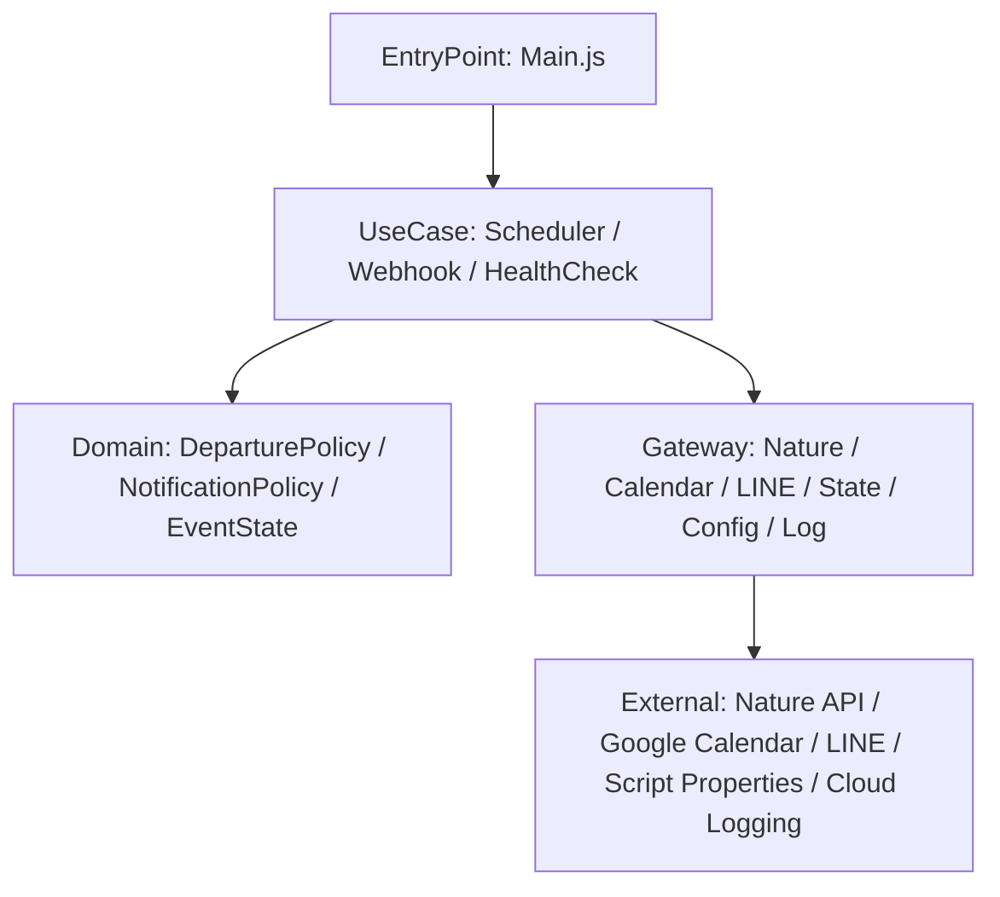
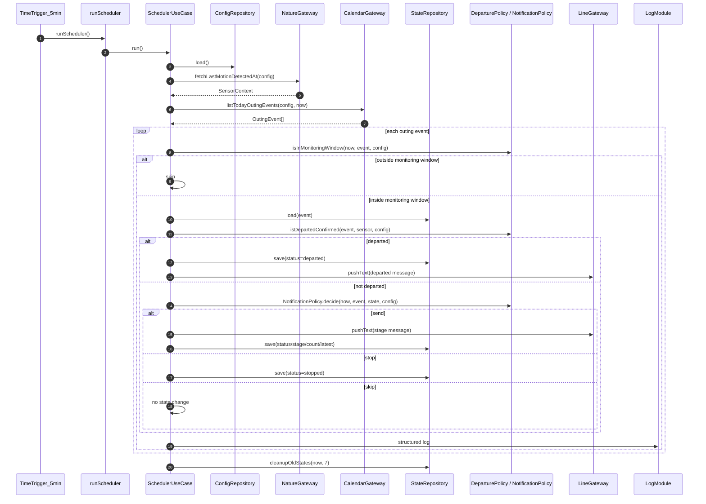
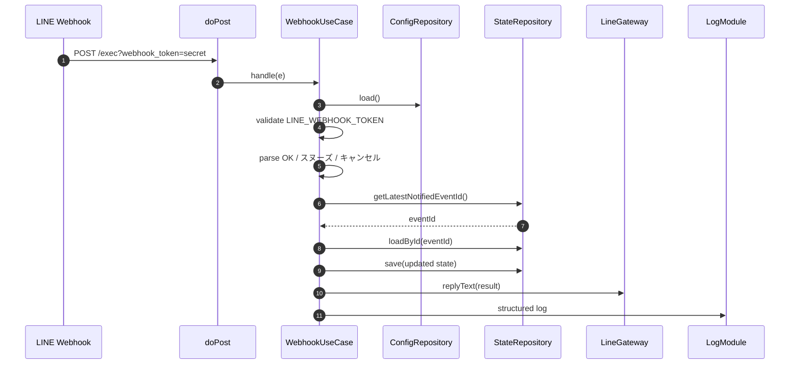

# Nature Remo 外出催促通知システム

Nature Remo の人感センサー、Google Calendar の外出予定、LINE Messaging API を組み合わせて、出発前後に外出を催促する Google Apps Script です。

## Architecture

### Layers

- `Main.js`: GAS のトリガー、Webhook、手動セットアップから直接呼ばれる関数だけを置く。
- `SchedulerUseCase.js`: 5分ごとの外出判定と通知を制御する。
- `WebhookUseCase.js`: LINE からの `OK` / `スヌーズ` / `キャンセル` を処理する。
- `HealthCheckUseCase.js`: 日次の正常稼働通知を送る。
- `DomainModule.js`: 外出判定、通知段階、静穏時間、予定状態の初期化を担当する。
- `*Module.js` / `ConfigRepository.js`: 外部 API、Calendar、LINE、Script Properties、Cloud Logging を隠蔽する。

## Scheduler Flow

## Departure Decision

外出済みと判定する条件は、Nature Remo の最終人感検知が次の両方を満たすことです。

1. 予定開始 `NOTICE_STAGE1_MIN_BEFORE` 分前以降に検知されている。
2. Nature API 取得時刻から見て `SENSOR_FRESHNESS_MINUTES` 分以内の検知である。

`SENSOR_FRESHNESS_MINUTES` は、古い人感検知を外出動作として誤採用しないための鮮度条件です。一度 `DEPARTED` として state に保存された予定は、後続実行でセンサー検知が古くなっても通知対象に戻りません。

## Notification Decision

`NotificationPolicy.decide()` は次の順で通知可否を決めます。

1. キャンセル済み、外出済み、終了済みなら通知しない。
2. 静穏時間中なら通知しない。
3. スヌーズ中なら通知しない。
4. 最大通知回数に達していれば `STOPPED` にする。
5. 予定開始までの残り時間から通知段階を決める。
6. 同じ段階の重複通知や繰り返し間隔を確認して送信可否を返す。

## Webhook Flow

Webhook の操作対象は `LATEST_NOTIFIED_EVENT_ID` に保存された直近通知の予定です。

## State

予定ごとの状態は Script Properties に `EVENT_STATE_<eventId>` として保存します。

主な状態:

- `not_departed`: 初期状態。
- `notifying`: 通知中。
- `snoozing`: 一時停止中。
- `departed`: 外出確認済み。
- `cancelled`: ユーザーが通知をキャンセル済み。
- `stopped`: 最大通知回数到達などで停止済み。

## Script Properties

### Required

- `NATURE_API_TOKEN`
- `LINE_CHANNEL_ACCESS_TOKEN`
- `LINE_TO_USER_ID`

### Optional

- `LINE_WEBHOOK_TOKEN`: Webhook URL の `webhook_token` と照合する。実運用では設定推奨。
- `NATURE_DEVICE_ID`: 対象 Nature Remo デバイス ID。
- `NATURE_DEVICE_NAME`: 対象 Nature Remo デバイス名。`NATURE_DEVICE_ID` が優先。
- `GOOGLE_CALENDAR_ID`: 既定値 `primary`。
- `OUTING_KEYWORDS`: 場所が空の予定でも外出予定とみなすキーワード CSV。既定値 `外出,出発,通院,会議`。
- `INCLUDE_ALL_DAY_EVENT`: 終日予定を対象に含めるか。既定値 `false`。
- `SENSOR_FRESHNESS_MINUTES`: 人感検知を外出確認に使える鮮度。既定値 `15`。
- `NOTICE_STAGE1_MIN_BEFORE`: 第1段階通知の開始分。既定値 `30`。
- `NOTICE_STAGE2_MIN_BEFORE`: 第2段階通知の開始分。既定値 `10`。
- `NOTICE_REPEAT_MINUTES`: 繰り返し通知間隔。既定値 `5`。
- `NOTICE_MAX_COUNT`: 最大通知回数。既定値 `6`。
- `SNOOZE_MINUTES`: スヌーズ時間。既定値 `15`。
- `QUIET_HOURS_START`: 静穏時間の開始。既定値 `22:00`。
- `QUIET_HOURS_END`: 静穏時間の終了。既定値 `07:00`。
- `HEALTH_CHECK_ENABLED`: 日次ヘルスチェック通知の有効化。既定値 `true`。

## Manual Setup

1. Script Properties に必須キーを設定する。
2. 必要に応じて任意キーを設定する。
3. `setupTriggers()` を手動実行して、5分トリガーと 8:00 ヘルスチェックトリガーを作る。
4. Web アプリとしてデプロイする。
5. LINE Developers の Webhook URL に `?webhook_token=...` 付き URL を設定する。
6. LINE Developers で Webhook 利用を ON にする。
