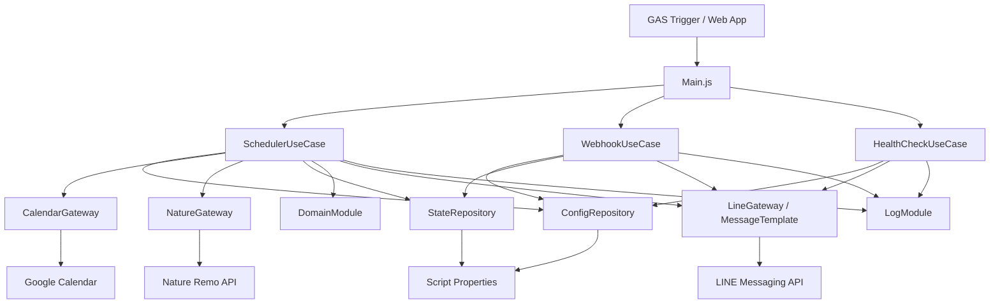

# 全体仕様書

## 1. システム概要

このシステムは、Google Calendar に登録された外出予定と Nature Remo の人感センサー情報を照合し、出発前後に外出動作が確認できない場合に LINE へ催促通知を送る Google Apps Script アプリケーションです。

主な目的は次の通りです。

- 当日の Google Calendar 予定から外出予定を抽出する。
- Nature Remo の人感センサーから最新の人感検知時刻を取得する。
- 予定開始前後の監視時間帯に外出動作があったか判定する。
- 外出動作が確認できない場合、段階的に LINE 通知を送る。
- ユーザーからの LINE 返信により、スヌーズまたはキャンセルを反映する。
- 毎日 1 回、正常稼働通知を送る。

## 2. 実行環境

- 実行基盤: Google Apps Script
- ランタイム: V8
- タイムゾーン: `Asia/Tokyo`
- 主な GAS サービス:
  - `CalendarApp`
  - `PropertiesService`
  - `UrlFetchApp`
  - `ScriptApp`
  - `ContentService`
  - `Utilities`
  - `Session`
- 外部 API:
  - Nature Remo Cloud API
  - LINE Messaging API

## 3. アーキテクチャ

コードは大きく次の層に分かれます。

- EntryPoint 層: GAS から直接呼ばれる関数を置く。
- UseCase 層: スケジューラー、Webhook、ヘルスチェックなどの業務フローを制御する。
- Domain 層: 外出判定、通知可否判定、状態初期化など、外部サービスに依存しないルールを持つ。
- Gateway / Repository 層: Google Calendar、Nature Remo、LINE、Script Properties、Cloud Logging との入出力を担当する。

## 4. 外部連携仕様

### 4.1 Google Calendar

当日の 0:00:00 から 23:59:59 までの予定を取得します。取得対象のカレンダーは `GOOGLE_CALENDAR_ID` で指定します。値が `primary` の場合は既定カレンダーを利用し、それ以外の場合は指定 ID のカレンダーを利用します。

外出予定として扱う条件は次の通りです。

- 予定に場所が設定されている場合は外出予定とみなす。
- 場所が空の場合は、タイトルまたは説明文に `OUTING_KEYWORDS` のいずれかが含まれる場合に外出予定とみなす。
- 終日予定は `INCLUDE_ALL_DAY_EVENT` が `true` の場合のみ対象にする。

### 4.2 Nature Remo Cloud API

`https://api.nature.global/1/devices` に GET リクエストを送り、デバイス一覧を取得します。認証には `NATURE_API_TOKEN` を Bearer トークンとして使用します。

対象デバイスの選択順は次の通りです。

1. `NATURE_DEVICE_ID` が設定されている場合、デバイス ID で絞り込む。
2. `NATURE_DEVICE_ID` が空で `NATURE_DEVICE_NAME` が設定されている場合、デバイス名で絞り込む。
3. どちらも空の場合、取得できた全デバイスを対象にする。

対象デバイス群の `newest_events.mo.created_at` のうち、最も新しい時刻を最新の人感検知時刻として扱います。

### 4.3 LINE Messaging API

プッシュ通知には `https://api.line.me/v2/bot/message/push` を利用します。Webhook への返信には `https://api.line.me/v2/bot/message/reply` を利用します。

認証には `LINE_CHANNEL_ACCESS_TOKEN` を Bearer トークンとして使用します。プッシュ通知の送信先は `LINE_TO_USER_ID` です。LINE API の HTTP ステータスが 2xx 以外の場合は例外として扱います。

### 4.4 Script Properties

Script Properties は設定値と予定状態の両方を保存します。設定値は `ConfigRepository`、予定状態は `StateRepository` が読み書きします。

予定ごとの状態は `EVENT_STATE_<eventId>` に JSON 文字列として保存します。直近に通知した予定 ID は `LATEST_NOTIFIED_EVENT_ID` に保存します。

## 5. 主要ユースケース

### 5.1 初期セットアップ

`setupTriggers()` を手動実行します。この処理は任意設定値の既定値を Script Properties に投入し、既存の `runScheduler` と `sendHealthCheck` トリガーを削除してから再作成します。

作成されるトリガーは次の通りです。

- `runScheduler`: 5 分ごとの時間主導トリガー。
- `sendHealthCheck`: 毎日 8 時の時間主導トリガー。

### 5.2 5 分ごとの外出判定

`runScheduler()` から `SchedulerUseCase.run()` が呼び出されます。

処理の流れは次の通りです。

1. 設定値を Script Properties から読み込む。
2. Nature Remo API から最新の人感検知情報を取得する。
3. Google Calendar から当日の外出予定を取得する。
4. 各予定について監視時間帯に入っているか判定する。
5. 予定ごとの状態を Script Properties から読み込む。存在しない場合は初期状態を作る。
6. Nature Remo の最新検知時刻をもとに外出済みか判定する。
7. 外出済みなら状態を `departed` にして、静穏時間外であれば外出確認メッセージを送る。
8. 外出未確認なら通知ポリシーで通知可否と通知段階を決める。
9. 通知対象なら LINE へ通知し、状態の通知段階、通知回数、最終通知時刻を更新する。
10. 最大通知回数に達した場合は状態を `stopped` にする。
11. 7 日より古い予定状態を削除する。

### 5.3 LINE Webhook による返信処理

`doPost(e)` から `WebhookUseCase.handle(e)` が呼び出されます。

Webhook URL に `LINE_WEBHOOK_TOKEN` を設定している場合、URL パラメータ `webhook_token` と照合します。トークンが一致しない場合は `forbidden` を返します。`LINE_WEBHOOK_TOKEN` が空の場合はトークン検証をスキップします。

処理対象となるコマンドは次の通りです。

- `OK`: `SNOOZE_MINUTES` 分だけ通知を一時停止する。状態は `snoozing` になる。
- `スヌーズ`: `OK` と同様に通知を一時停止する。返信文言だけが異なる。
- `キャンセル`: 予定の通知をキャンセルする。状態は `cancelled` になる。

Webhook の操作対象は `LATEST_NOTIFIED_EVENT_ID` に保存された直近通知の予定です。対象状態が見つからない場合は、その旨を LINE に返信します。

### 5.4 日次ヘルスチェック

`sendHealthCheck()` から `HealthCheckUseCase.send()` が呼び出されます。`HEALTH_CHECK_ENABLED` が `true` の場合、現在時刻を含む正常稼働メッセージを LINE に送ります。`false` の場合は送信せずログのみ出します。

## 6. 外出判定仕様

外出済みと判定するには、Nature Remo の最新人感検知時刻が次の条件をすべて満たす必要があります。

- 最新人感検知時刻が、予定開始 `NOTICE_STAGE1_MIN_BEFORE` 分前以降である。
- 最新人感検知時刻が、Nature API 取得時刻以前である。
- 最新人感検知時刻が、取得時刻から見て `SENSOR_FRESHNESS_MINUTES` 分以内である。

監視時間帯は、予定開始 `NOTICE_STAGE1_MIN_BEFORE` 分前から、予定開始後 `NOTICE_REPEAT_MINUTES * NOTICE_MAX_COUNT` 分までです。この範囲外の予定は処理対象外になります。

## 7. 通知判定仕様

通知可否は `NotificationPolicy.decide()` が決定します。判定順は次の通りです。

1. 予定がキャンセル済み、外出済み、または終了済みの場合は通知しない。
2. 静穏時間中の場合は通知しない。
3. スヌーズ期限内の場合は通知しない。
4. 通知回数が `NOTICE_MAX_COUNT` 以上の場合は `stopped` にする。
5. 予定開始までの残り分数から通知段階を決める。
6. 同じ段階の重複通知や繰り返し通知間隔を確認する。
7. 条件を満たした場合のみ送信する。

通知段階は次の通りです。

- `PREPARE`: 予定開始 `NOTICE_STAGE1_MIN_BEFORE` 分前以降。
- `DEPARTURE`: 予定開始 `NOTICE_STAGE2_MIN_BEFORE` 分前以降。
- `WARNING`: 予定開始時刻以降。
- `REPEAT_WARNING`: 予定開始から `NOTICE_REPEAT_MINUTES` 分以上経過後。以降は `NOTICE_REPEAT_MINUTES` ごとに繰り返し可能。

`PREPARE`、`DEPARTURE`、`WARNING` は現在段階より進んだ場合のみ送信します。`REPEAT_WARNING` は最終通知時刻から `NOTICE_REPEAT_MINUTES` 分以上経過していれば再送できます。

## 8. 状態仕様

予定状態は次のフィールドを持ちます。

- `eventId`: 状態保存用の予定 ID。
- `eventTitle`: 予定タイトル。
- `eventStartIso`: 予定開始時刻の ISO 文字列。
- `status`: 予定の処理状態。
- `currentStage`: 現在の通知段階。
- `noticeCount`: 通知回数。
- `lastNoticeAtIso`: 最終通知時刻。
- `snoozeUntilIso`: スヌーズ期限。
- `cancelled`: キャンセル済みフラグ。
- `departedConfirmedAtIso`: 外出確認時刻。
- `updatedAtIso`: 状態更新時刻。

`status` の値は次の通りです。

- `not_departed`: 初期状態。外出確認も通知完了もしていない。
- `notifying`: 通知中。
- `snoozing`: スヌーズ中。
- `departed`: 外出確認済み。
- `cancelled`: ユーザーにより通知キャンセル済み。
- `stopped`: 最大通知回数到達などにより停止済み。

## 9. ログ仕様

ログは `LogModule` が JSON 文字列として `console.log` または `console.error` に出力します。各ログには次の項目が含まれます。

- `timestamp`: ログ出力時刻。
- `traceId`: 一連の処理を追跡する UUID。
- `category`: ログ分類。
- `payload`: 詳細情報。

主なカテゴリは `schedule`、`sensor`、`state`、`notify`、`health`、`error` です。

## 10. エラー処理仕様

スケジューラー全体、Webhook、ヘルスチェックは、それぞれ最上位で例外を捕捉し、Cloud Logging に相当するログへエラー情報を出力します。

Nature Remo API 取得に失敗した場合、スケジューラーはその回の処理を中断します。LINE 通知に失敗した場合、対象予定の通知送信エラーをログに残します。Webhook 返信に失敗した場合も、返信失敗としてログに残します。

## 11. 制約と注意事項

- 現在の Webhook は直近に通知した 1 件の予定だけを操作対象にします。複数予定が近い時刻に通知された場合、返信対象は最後に通知された予定になります。
- 外出判定は Nature Remo の人感検知時刻に依存します。センサー設置位置や検知遅延により、実際の外出と判定がずれる可能性があります。
- Script Properties は設定値と状態の両方を保存するため、キーの衝突を避ける必要があります。
- `LINE_WEBHOOK_TOKEN` が未設定の場合、Webhook の URL トークン検証は行われません。実運用では設定が推奨されます。
